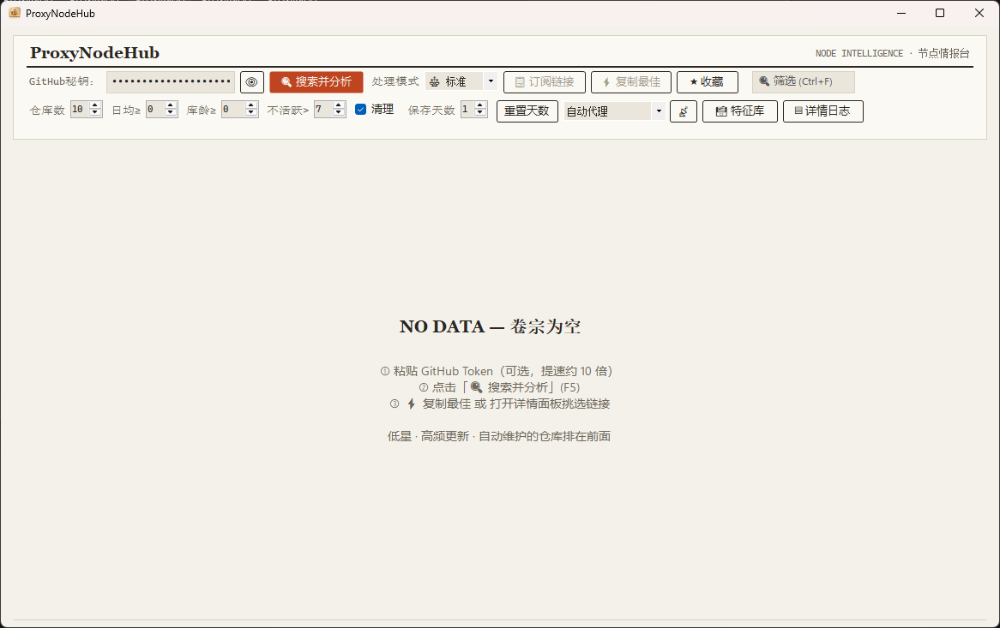

<div align="center">

# ProxyNodeHub

### GitHub 免费节点仓库监控与聚合工具

[English](README.en.md) | **中文**

<p align="center">
    <a href="https://www.koolcenter.com/" alt="酷友社"></a>
</p>

<p align="center">
    <a href="https://linux.do" alt="LINUX DO"></a>
</p>



</div>

---

> ⭐ **如果 ProxyNodeHub 对你有用，请务必点一个 Star，这是我持续维护这个项目最大的动力。**

---

## 项目简介

ProxyNodeHub 用于发现 GitHub 上活跃的免费节点仓库：分析活跃度、去重分散的节点、直接给出可用的订阅链接。点一次「搜索并分析」，剩下的梳理工作全部由它完成。

不必再逐个仓库翻找、比对、手动拼接订阅。它会挑出更新最勤、维护最稳的仓库，合并去重后一次导出；也能翻出那些藏在角落、不易察觉的冷门仓库——在免费节点这个领域，冷门往往意味着负载低、活得久，那才是真正好用的宝藏节点。

## 功能特性

| | |
|---|---|
| **六层探测引擎** | 特征库学习 → 硬编码映射 → 文件树筛选 → 常见路径探测 → README 解析 → 兜底候选 |
| **并发搜索** | 8 个关键词并发请求 GitHub REST API |
| **活跃度评分** | 提交频率 + 均匀度 + 自动化 + 隐蔽度，100 分制 |
| **节点去重** | 以 `server:port` 为键去重，合并导出订阅 |
| **四种处理模式** | 🚀 极速 / ⚖️ 标准 / 🔍 深度 / 🐢 兼容，各自独立并发度 |
| **自动代理** | 13 个加速镜像，自动测速、失效回退、5 分钟结果缓存 |
| **搜索历史过滤** | 已搜索仓库自动跳过（1–30 天可调） |
| **收藏管理** | 独立视图，重启后保留 |
| **特征库学习** | 自动记住探测成功过的路径，下次更快 |
| **日志持久化** | 日志滚动保存，保留天数可调，一键清理 |

## 运行环境

- **自包含版** — Windows 10 及以上（x64），无需安装任何运行时。
- **框架依赖版** — Windows 10 及以上（x64），并需安装 [.NET 8 Desktop Runtime](https://dotnet.microsoft.com/download/dotnet/8.0)。

## 快速开始

1. 从 [Releases](../../releases) 获取构建包——无任何前置依赖请选 `ProxyNodeHub_v0.0.1_self-contained.zip`。
2. 解压到任意目录，运行 `ProxyNodeHub.exe`。
3. 按 **F5**（或点击「搜索并分析」）开始搜索与分析。

GitHub 秘钥为可选项，但建议填写：匿名搜索 API 每小时限额 60 次，填入后可提升至 5000 次。秘钥经 Windows 凭据管理器按用户加密存储。

## 编译

```bash
# 自包含版（单文件，约 68 MB，内含运行时）
dotnet publish src/ProxyNodeHub.csproj -c Release -r win-x64 -p:SelfContained=true -o dist/self-contained

# 框架依赖版（约 3 MB，需目标机安装 .NET 8 运行时）
dotnet publish src/ProxyNodeHub.csproj -c Release -r win-x64 -p:SelfContained=false -o dist/framework-dependent
```

需要 .NET 8 SDK 及 Windows Desktop 工作负载。

> **关于体积**：自包含版无法裁剪。WinForms 不支持 `PublishTrimmed`（NETSDK1175），因此约 65 MB 是 .NET 8 WinForms 单文件发布的下限。

## 快捷键

| 快捷键 | 功能 |
|---|---|
| `F5` | 开始 / 取消搜索 |
| `Ctrl+C` | 复制最佳订阅链接 |
| `Ctrl+L` | 切换详情面板 |
| `Ctrl+D` | 切换收藏夹 |
| `Ctrl+F` | 聚焦筛选框 |
| `Esc` | 关闭弹窗 |

## 配置说明

工具学到的所有状态都放在可执行文件之外，位于 `%AppData%\ProxyNodeHub\`：

| 文件 / 路径 | 用途 |
|---|---|
| `known_repos.json` | 随 EXE 一起分发——已知仓库到订阅路径的映射 |
| `searched_repos.json` | 搜索历史，按条目设置过期时间 |
| `log.txt` | 日志滚动保存，启动时按保留天数清理 |
| 特征库 JSON | 探测成功过的路径，供 L1 层复用 |

## 项目结构

```
src/
├── Program.cs               # 入口点
├── MainForm.cs              # 主窗体、工具栏、表格、日志面板
├── SubscriptionFinder.cs    # 六层探测引擎
├── GitHubService.cs         # GitHub HTTP + 代理镜像 + 测速
├── FeatureLibrary.cs        # 特征库 + 仓库分类器
├── CustomFeatureLibrary.cs  # 自定义特征码
├── NodeParser.cs            # 节点解析 / 去重 / 合并
├── KnownRepoLoader.cs       # known_repos.json 加载器
├── SearchHistory.cs         # 搜索历史持久化
├── LogStore.cs              # 日志持久化 + 保留天数
├── Settings.cs              # 设置、缓存、收藏
├── Models.cs                # 数据模型
├── Theme.cs                 # 颜色令牌
├── Fonts.cs                 # 字体系统
├── ModernButton.cs          # 按钮控件
├── BufferedGridView.cs      # 双缓冲表格
├── Win32Interop.cs          # Win32 互操作
├── LanguageFilter.cs        # 语言过滤
├── ExportDialog.cs          # 导出对话框
├── FeatureLibraryDialog.cs  # 特征库管理
├── AboutDialog.cs           # 关于对话框
├── ProxyNodeHub.csproj
├── known_repos.json         # 已知仓库映射
└── logo.ico / logo.png      # 应用图标
```

## 技术栈

- C# / WinForms，.NET 8（`net8.0-windows`，`win-x64`）
- Windows 10 及以上，x64
- 除 `System.Security.Cryptography.ProtectedData` 外无第三方 NuGet 依赖

## 作者

**Zoyaya** — [github.com/wanvfx](https://github.com/wanvfx)

## 许可协议

基于 [MIT License](LICENSE) 发布。
